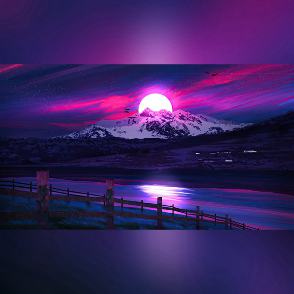

# 🚀 Norm IMG

Normaliza una imagen en formato cuadrado rellenado bordes con la misma imagen blurreada.

#### Mode de Uso
```shell
node app.js --input [filename] -s [new side size ] -c [compression] -b [Side blur]
```
#### Valores por defecto
```text
-s [new side size ] = 1000 (Valor en px)
-c [compression] = 80 (Valor en %)
-b [Side blur] = 40 (Valor en %)
```
## Ejemplo 1 - Imagen de Landscape a Square
```shell
node app.js --input .\img\img1.jpg  -s 600  -c 100 -b 50
```
#### Original

#### Imagen cuadrada


## Ejemplo 2 - Imagen de Portrait a Square
```shell
node app.js --input .\img\img2.jpg  -s 800  -c 100 -b 20
```
#### Original

#### Imagen cuadrada
